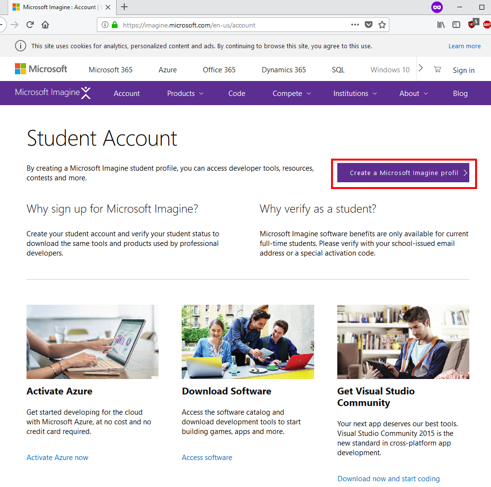
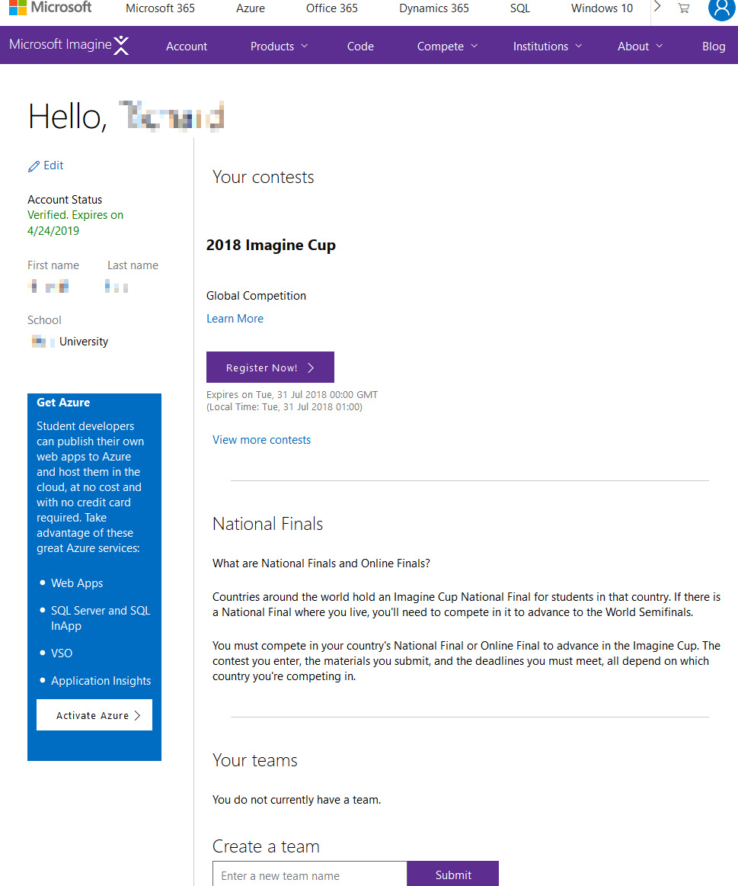
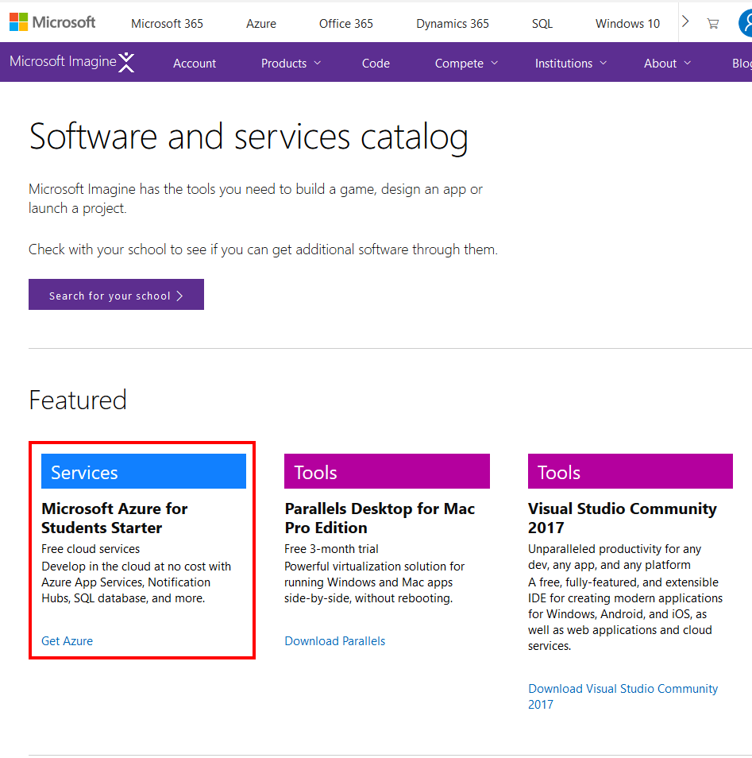
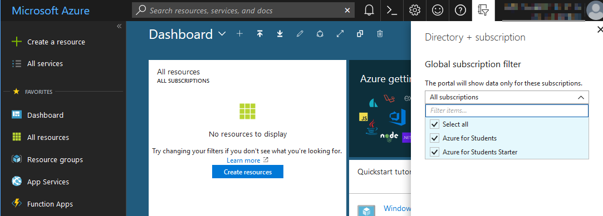

# Azure for Students Starter (via Microsoft Imagine)
Some students in certain institutions cannot sign up for Azure for Students without first registering with Microsoft Imagine (this is probably something to do with the way the academic institution identifies the students in their system, but I'm not sure why it happens). You should only follow these instructions if the Azure for Students instructions did not work for you (the only students I've encountered this issue have @ulster.ac.uk addresses, but there could be other students affected in same way).  

Thanks to **Richard Ryan** who figured out this workaround (edited slightly):
1. Open an InPrivate or InCognito browser window (to clear your cookies and previous sign-ins)
1. Navigate to [Microsoft Imagine](https://imagine.microsoft.com/en-us/account)
   1. Click on Create a Microsoft Imagine Profile  
     
     
     
   1.	Follow account setup instructions and ensure to use your university or college account. In the example below, we used an @ulster.ac.uk account to complete the steps. Change the answers to suit your own country/college, these are an example:
        1. Country or Region – **Ireland** 
        1. Imagine Compete Country – **Ireland**
        1. Graduation Date – **June 2019**
        1. School Level – **College/Undergrad**
        1. School Name – **Ulster University**    
        
          
        
   1. Go to [Microsoft Imagine Catalog](https://imagine.microsoft.com/en-us/catalog)  
        1. Select **Microsoft Azure for Students Starter**  
          
          
          
        1. Register for Azure for Students Starter and you should be presented with the Azure Portal
        1. Once at the Azure portal, click the Directory + Subscription button on the top right of the screen and check Azure for Student Starter is listed 
    1. Open a new tab [Azure for Students](https://azure.microsoft.com/en-ie/free/students/) and Click **Activate Now**

On returning to the Azure Portal dashboard you should see two subscriptions now (ensure you're using Azure for Students, not Azure for Students Starter, as the former comes with credits you can spend on advancecd features).  
  
  

